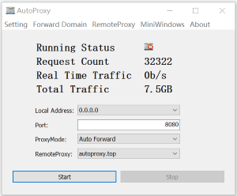
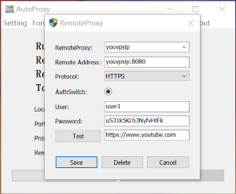
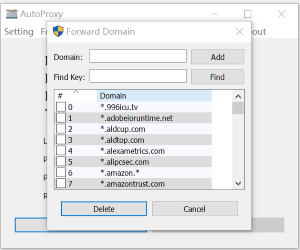
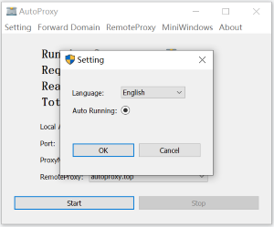
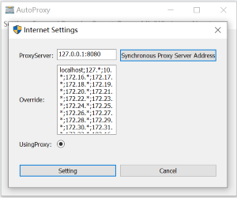

# Autoproxy

[English](./README.md)
[中文](./README_ZH_CN.md) 

The project provides browser http proxy proxy service, supports https and http protocol proxy; can deploy multi-level proxy; supports TLS protocol encryption; mainly uses tools for accessing external websites with intranet hosts;

## Features
- Support multiple forwarding modes
- Support statistical Console
- Support secondary forwarding
- Support TLS transmission encryption
- Support dynamic routing
- Support custom forwarding domain name settings
- Support multiple platforms

## Usage Help

### [Download Binary](https://github.com/easymesh/autoproxy-windows/releases)

### Download and run the windows client
- Choose the latest windows desktop client， such as. `autoproxy_desktop.zip`
- Unzip and double-click to run
- Start successfully, you need to manually add remote proxy service.

#### Home windows
- Provide basic setting options
- Forwarding domain name rules
- Remote service configuration
- Minimize and hide the window
- Real-time statistics console
- Local proxy address and port settings

#### Add remote service

After the configuration is complete, you can click Test to try to test the connectivity

#### Edit forward domain

Support fuzzy matching rules, For example:

- `*.domain.*` : Middle field matching
- `*.domain.com` : Suffix match
- `www.domain.*` : Prefix match
- `www.domain.com` : Exact match

#### Multi-language support

#### Synchronously modify local Internet setting options

### Everything is ready, return to the home windows and start the service; happy you life;

### If you think this software is good, you can consider asking the author for coffee;

### [paypal.me](https://paypal.me/lixiangyun)

### Alipay

### Wechat Pay 

### Thanks Support
