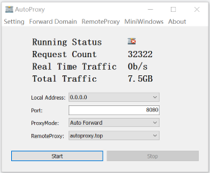
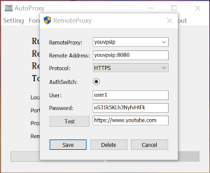
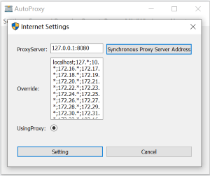

# Autoproxy

[English](./README.md)
[中文](./README_ZH_CN.md) 

该项目提供浏览器http proxy代理服务，支持https、http协议代理；可以部署多级代理；支持TLS协议加密；主要使用与内网主机访问外部网站工具；

## 特性如下
- 支持多种转发方式
- 支持统计控制台
- 支持二次转发
- 支持TLS传输加密
- 支持动态路由
- 支持自定义转发域名设置
- 支持多种平台

## 使用说明

#### 本地windows客户端

### [Download Binary](https://github.com/easymesh/autoproxy-windows/releases)

本项目提供了小白使用的带UI的客户端，方便使用；在Release 版本下载 `autoproxy_desktop.zip`
然后解压双击运行即可，本程序是免安装的绿色软件，不会破坏系统；

特性如下：

- 提供基本设置选项
- 转发域名规则
- 远程服务配置
- 最小化和隐藏窗口
- 实时统计控制台
- 本地代理地址和端口设置

#### 添加二级代理服务

配置完成后，您可以单击“测试”以尝试网络连接性；

#### 编辑域名转发规则

支持几种匹配规则，例如：

- `*.domain.*` : 匹配中间部分域名字段
- `*.domain.com` : 匹配后面域名字段
- `www.domain.*` : 匹配前面域名字段
- `www.domain.com` : 完整匹配域名

#### 提供多语言设置

#### 同步修改本地Internet设置选项

### 一切就绪，返回主窗口并启动服务； 快乐生活

### [paypal.me](https://paypal.me/lixiangyun)

### Alipay

### Wechat Pay 

### 感谢支持
